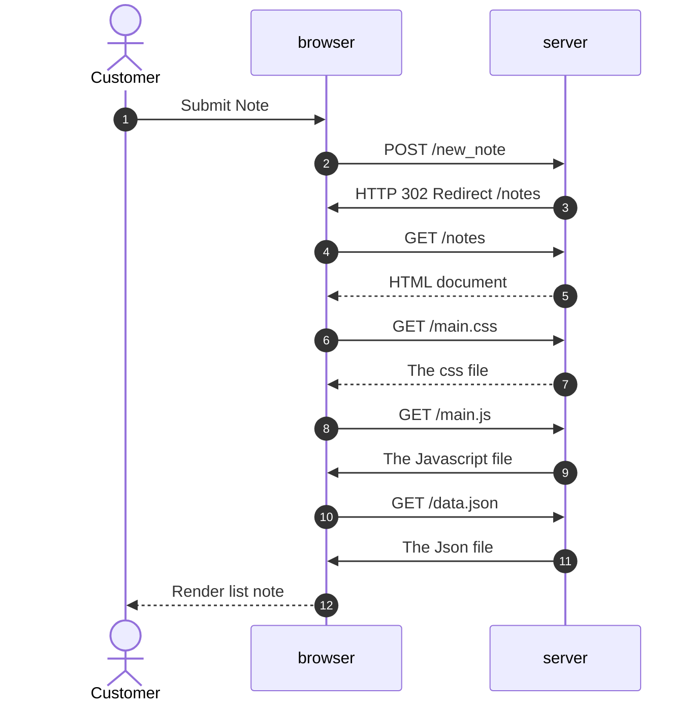

```mermaid

sequenceDiagram
    autonumber
    actor Customer
    participant browser
    participant server
    Customer->>browser: Submit Note
    browser->>server: POST /new_note
    server->>browser: HTTP 302 Redirect /notes
    browser->>server: GET /notes
    server-->>browser: HTML document
    browser->>server: GET /main.css
    server-->>browser: The css file
    browser->>server: GET /main.js
    server->>browser: The Javascript file
    browser->>server: GET /data.json
    server->>browser: The Json file
    browser-->>Customer: Render list note
```